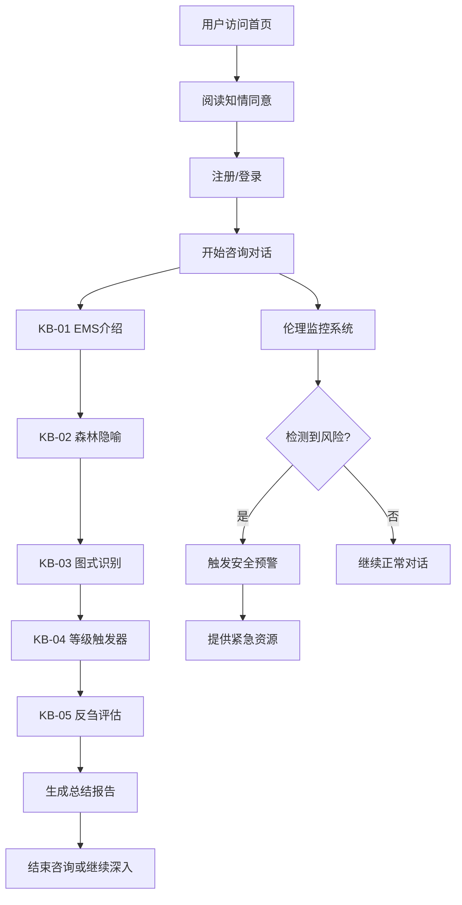

# AI咨询师Web应用产品需求文档

## 1. 产品概述

本产品是一个基于阿里云百炼平台qwen3-omni-flash模型的AI心理咨询师Web应用，旨在为用户提供专业、安全、符合伦理规范的心理支持服务。产品严格遵循中国心理学会临床与咨询心理学工作伦理守则，结合早期不良图式(EMS)理论和接纳承诺疗法(ACT)技术，为用户提供结构化的心理健康支持。

- 解决问题：为需要心理支持但难以获得专业服务的用户提供24/7可访问的AI咨询服务
- 目标用户：寻求心理支持的成年用户，特别是面临情绪困扰、人际关系问题或自我认知挑战的个体
- 市场价值：填补心理健康服务供需缺口，提供标准化、可扩展的心理支持解决方案

## 2. 核心功能

### 2.1 用户角色

| 角色 | 注册方式 | 核心权限 |
|------|----------|----------|
| 普通用户 | 手机号/邮箱注册 | 进行心理咨询对话、查看历史记录、导出会话报告 |
| 管理员 | 系统分配 | 监控系统运行、管理用户、审核对话质量、处理伦理投诉 |

### 2.2 功能模块

本AI咨询师应用包含以下核心页面：
1. **首页**：产品介绍、服务说明、知情同意展示
2. **咨询对话页**：实时AI咨询对话、多模态交互支持
3. **个人中心**：用户信息管理、咨询历史、进度跟踪
4. **资源库页**：心理健康教育资源、自助工具
5. **帮助中心**：使用指南、常见问题、紧急联系方式

### 2.3 页面详情

| 页面名称 | 模块名称 | 功能描述 |
|----------|----------|----------|
| 首页 | 产品介绍区 | 展示AI咨询师功能特点、服务范围、使用流程 |
| 首页 | 知情同意区 | 显示服务条款、隐私政策、伦理守则、风险提示 |
| 首页 | 快速开始区 | 引导用户注册登录、开始首次咨询 |
| 咨询对话页 | 对话界面 | 支持文本、语音输入输出的实时对话功能 |
| 咨询对话页 | KB流程引擎 | 按照KB-01至KB-05线性执行EMS和ACT干预流程 |
| 咨询对话页 | 伦理监控 | 实时检测违规内容、触发安全预警、执行保密例外 |
| 咨询对话页 | 情绪状态跟踪 | 记录用户情绪变化、风险评估、危机干预提示 |
| 个人中心 | 用户档案 | 管理个人信息、咨询偏好设置、联系方式 |
| 个人中心 | 咨询历史 | 查看历史对话记录、下载会话报告、进度可视化 |
| 个人中心 | 安全设置 | 修改密码、隐私设置、数据导出删除 |
| 资源库页 | 教育内容 | 心理健康知识文章、视频资源、自助评估工具 |
| 资源库页 | 练习工具 | ACT技巧练习、正念冥想、情绪调节技能 |
| 帮助中心 | 使用指南 | 详细的产品使用说明、最佳实践建议 |
| 帮助中心 | 紧急资源 | 危机干预热线、专业转介信息、急救联系方式 |

## 3. 核心流程

### 3.1 用户咨询流程

用户首次访问时需要完成知情同意确认，了解服务性质、局限性和风险。进入咨询对话后，AI系统按照预设的KB流程线性工作：

1. **KB-01 EMS概念介绍**：向用户科普早期不良图式，引导从历史-当下-价值/行动路径观察
2. **KB-02 森林隐喻**：使用河流和两片森林的隐喻帮助用户理解内在体验
3. **KB-03 图式识别**：基于YSQ-S3结果识别用户的高分图式并探索学习史
4. **KB-04 等级触发器**：识别和命名负性自我内容的层级结构
5. **KB-05 反刍评估**：评估反刍思维对情绪和人际关系的影响

### 3.2 管理员监控流程

管理员可以实时监控系统运行状态，审核对话质量，处理用户投诉和伦理问题。

## 4. 用户界面设计

### 4.1 设计风格

- **主色调**：温和的蓝绿色(#4A90A4)作为主色，传达专业和信任感
- **辅助色**：柔和的灰色(#F5F7FA)作为背景色，米白色(#FEFEFE)作为卡片背景
- **按钮样式**：圆角矩形设计，主要按钮使用渐变效果，次要按钮使用边框样式
- **字体**：中文使用思源黑体，英文使用Inter，主要文字16px，辅助文字14px
- **布局风格**：卡片式布局，左侧导航栏，响应式设计适配移动端
- **图标风格**：使用简洁的线性图标，配合温暖的插画元素增强亲和力

### 4.2 页面设计概览

| 页面名称 | 模块名称 | UI元素 |
|----------|----------|--------|
| 首页 | 产品介绍区 | 大标题、功能特点卡片、渐变背景、CTA按钮 |
| 首页 | 知情同意区 | 折叠式信息面板、复选框确认、法律条文链接 |
| 咨询对话页 | 对话界面 | 聊天气泡设计、语音波形动画、输入框工具栏 |
| 咨询对话页 | 状态指示器 | 进度条显示KB流程、情绪状态色彩指示 |
| 个人中心 | 数据可视化 | 情绪趋势图表、咨询次数统计、进度环形图 |
| 资源库页 | 内容卡片 | 图文混排卡片、标签分类、搜索筛选功能 |

### 4.3 响应式设计

产品采用移动优先的响应式设计策略，支持桌面端、平板和手机端访问。在移动端优化触摸交互体验，语音输入功能在移动设备上更加便捷。桌面端提供更丰富的数据展示和管理功能。

## 5. 技术要求

### 5.1 核心技术栈
- 前端：React 18 + TypeScript + Tailwind CSS
- 后端：Express.js + Node.js
- 数据库：Supabase (PostgreSQL)
- AI模型：阿里云百炼 qwen3-omni-flash
- 部署：Docker容器化部署

### 5.2 关键技术特性
- 实时语音对话支持
- 多模态交互(文本+语音)
- 端到端加密通信
- 实时伦理合规监控
- 自动化风险评估
- 数据备份与恢复

### 5.3 安全与合规
- 严格遵循《中国心理学会临床与咨询心理学工作伦理守则》
- 实施数据最小化原则和用户隐私保护
- 建立完善的保密例外处理机制
- 提供紧急情况下的人工干预通道
- 定期进行安全审计和伦理评估

## 6. 成功指标

- 用户满意度：咨询后满意度评分≥4.0/5.0
- 安全性：零重大伦理违规事件
- 可用性：系统可用性≥99.5%
- 响应速度：AI回复延迟<3秒
- 用户留存：30天用户留存率≥60%