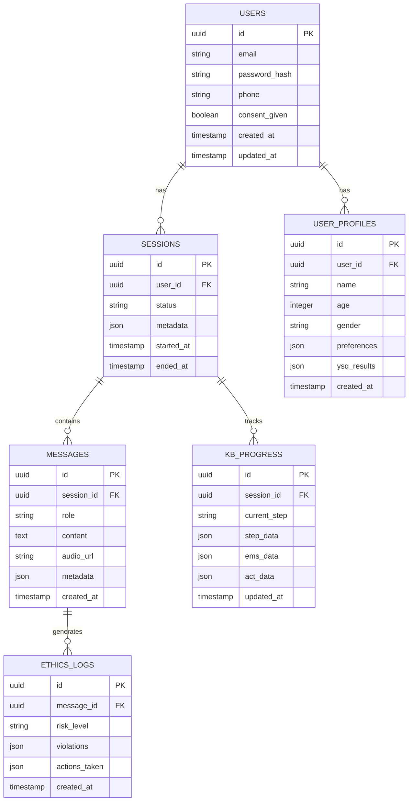

# AI鍜ㄨ甯圵eb搴旂敤鎶€鏈灦鏋勬枃妗?
## 1. 鏋舵瀯璁捐

```mermaid
graph TD
    A[鐢ㄦ埛娴忚鍣╙ --> B[React鍓嶇搴旂敤]
    B --> C[Express.js鍚庣鏈嶅姟]
    C --> D[Supabase鏁版嵁搴揮
    C --> E[闃块噷浜戠櫨鐐糀PI]
    C --> F[Redis缂撳瓨]
    
    subgraph "鍓嶇灞?
        B
    end
    
    subgraph "鍚庣灞?
        C
        F
    end
    
    subgraph "鏁版嵁灞?
        D
    end
    
    subgraph "澶栭儴鏈嶅姟"
        E
    end
```

## 2. 鎶€鏈弿杩?
* 鍓嶇锛歊eact\@18 + TypeScript\@5 + Tailwind CSS\@3 + Vite\@5

* 鍚庣锛欵xpress.js\@4 + Node.js\@18 + TypeScript\@5

* 鏁版嵁搴擄細Supabase (PostgreSQL\@15)

* 缂撳瓨锛歊edis\@7

* AI鏈嶅姟锛氶樋閲屼簯鐧剧偧 qwen3-omni-flash API

* 瀹炴椂閫氫俊锛歋ocket.io\@4

* 韬唤璁よ瘉锛歋upabase Auth

* 鏂囦欢瀛樺偍锛歋upabase Storage

## 3. 璺敱瀹氫箟

| 璺敱         | 鐢ㄩ€?              |
| ---------- | ---------------- |
| /          | 棣栭〉锛屽睍绀轰骇鍝佷粙缁嶅拰鐭ユ儏鍚屾剰   |
| /login     | 鐧诲綍椤甸潰锛岀敤鎴疯韩浠介獙璇?     |
| /register  | 娉ㄥ唽椤甸潰锛屾柊鐢ㄦ埛娉ㄥ唽       |
| /chat      | 鍜ㄨ瀵硅瘽椤甸潰锛屾牳蹇傾I浜や簰鍔熻兘  |
| /profile   | 涓汉涓績锛岀敤鎴蜂俊鎭拰鍜ㄨ鍘嗗彶   |
| /resources | 璧勬簮搴撻〉闈紝蹇冪悊鍋ュ悍鏁欒偛鍐呭   |
| /help      | 甯姪涓績锛屼娇鐢ㄦ寚鍗楀拰绱ф€ヨ仈绯绘柟寮?|
| /admin     | 绠＄悊鍚庡彴锛岀郴缁熺洃鎺у拰鐢ㄦ埛绠＄悊   |

## 4. API瀹氫箟

### 4.1 鏍稿績API

#### 鐢ㄦ埛璁よ瘉鐩稿叧

```
POST /api/auth/register
```

璇锋眰鍙傛暟锛?
| 鍙傛暟鍚?     | 鍙傛暟绫诲瀷    | 鏄惁蹇呴渶  | 鎻忚堪     |
| -------- | ------- | ----- | ------ |
| email    | string  | true  | 鐢ㄦ埛閭   |
| password | string  | true  | 鐢ㄦ埛瀵嗙爜   |
| phone    | string  | false | 鎵嬫満鍙风爜   |
| consent  | boolean | true  | 鐭ユ儏鍚屾剰纭 |

鍝嶅簲鍙傛暟锛?
| 鍙傛暟鍚?    | 鍙傛暟绫诲瀷    | 鎻忚堪      |
| ------- | ------- | ------- |
| success | boolean | 娉ㄥ唽鏄惁鎴愬姛  |
| user    | object  | 鐢ㄦ埛淇℃伅瀵硅薄  |
| token   | string  | JWT璁よ瘉浠ょ墝 |

#### AI鍜ㄨ瀵硅瘽鐩稿叧

```
POST /api/chat/message
```

璇锋眰鍙傛暟锛?
| 鍙傛暟鍚?          | 鍙傛暟绫诲瀷   | 鏄惁蹇呴渶  | 鎻忚堪           |
| ------------- | ------ | ----- | ------------ |
| message       | string | true  | 鐢ㄦ埛杈撳叆娑堟伅       |
| sessionId     | string | true  | 浼氳瘽ID         |
| audioData     | string | false | 璇煶鏁版嵁(base64) |
| currentKBStep | string | true  | 褰撳墠KB娴佺▼姝ラ     |

鍝嶅簲鍙傛暟锛?
| 鍙傛暟鍚?          | 鍙傛暟绫诲瀷   | 鎻忚堪             |
| ------------- | ------ | -------------- |
| response      | string | AI鍥炲鏂囨湰         |
| audioResponse | string | AI璇煶鍥炲(base64) |
| nextKBStep    | string | 涓嬩竴涓狵B娴佺▼姝ラ      |
| riskLevel     | string | 椋庨櫓璇勪及绛夌骇         |
| ethicsFlags   | array  | 浼︾悊妫€鏌ユ爣璁?        |

#### 浼氳瘽绠＄悊鐩稿叧

```
GET /api/sessions/{userId}
```

鍝嶅簲鍙傛暟锛?
| 鍙傛暟鍚?        | 鍙傛暟绫诲瀷   | 鎻忚堪     |
| ----------- | ------ | ------ |
| sessions    | array  | 鐢ㄦ埛浼氳瘽鍒楄〃 |
| totalCount  | number | 鎬讳細璇濇暟閲? |
| lastSession | object | 鏈€杩戜細璇濅俊鎭?|

#### 浼︾悊鐩戞帶鐩稿叧

```
POST /api/ethics/check
```

璇锋眰鍙傛暟锛?
| 鍙傛暟鍚?    | 鍙傛暟绫诲瀷   | 鏄惁蹇呴渶 | 鎻忚堪    |
| ------- | ------ | ---- | ----- |
| content | string | true | 寰呮鏌ュ唴瀹?|
| context | object | true | 瀵硅瘽涓婁笅鏂?|
| userId  | string | true | 鐢ㄦ埛ID  |

鍝嶅簲鍙傛暟锛?
| 鍙傛暟鍚?        | 鍙傛暟绫诲瀷    | 鎻忚堪                             |
| ----------- | ------- | ------------------------------ |
| isCompliant | boolean | 鏄惁绗﹀悎浼︾悊瑙勮寖                       |
| violations  | array   | 杩濊椤圭洰鍒楄〃                         |
| riskLevel   | string  | 椋庨櫓绛夌骇(low/medium/high/critical) |
| actions     | array   | 寤鸿閲囧彇鐨勮鍔?                       |

## 5. 鏈嶅姟鍣ㄦ灦鏋勫浘

```mermaid
graph TD
    A[瀹㈡埛绔姹俔 --> B[API缃戝叧灞俔
    B --> C[韬唤璁よ瘉涓棿浠禲
    C --> D[浼︾悊妫€鏌ヤ腑闂翠欢]
    D --> E[涓氬姟閫昏緫灞俔
    E --> F[鏁版嵁璁块棶灞俔
    F --> G[(Supabase鏁版嵁搴?]
    
    E --> H[AI鏈嶅姟灞俔
    H --> I[闃块噷浜戠櫨鐐糀PI]
    
    E --> J[缂撳瓨灞俔
    J --> K[(Redis缂撳瓨)]
    
    subgraph "鏈嶅姟鍣ㄧ"
        B
        C
        D
        E
        F
        H
        J
    end
```

## 6. 鏁版嵁妯″瀷

### 6.1 鏁版嵁妯″瀷瀹氫箟



### 6.2 鏁版嵁瀹氫箟璇█

#### 鐢ㄦ埛琛?(users)

```sql
-- 鍒涘缓鐢ㄦ埛琛?CREATE TABLE users (
    id UUID PRIMARY KEY DEFAULT gen_random_uuid(),
    email VARCHAR(255) UNIQUE NOT NULL,
    password_hash VARCHAR(255) NOT NULL,
    phone VARCHAR(20),
    consent_given BOOLEAN DEFAULT FALSE,
    created_at TIMESTAMP WITH TIME ZONE DEFAULT NOW(),
    updated_at TIMESTAMP WITH TIME ZONE DEFAULT NOW()
);

-- 鍒涘缓绱㈠紩
CREATE INDEX idx_users_email ON users(email);
CREATE INDEX idx_users_created_at ON users(created_at DESC);

-- 璁剧疆RLS绛栫暐
ALTER TABLE users ENABLE ROW LEVEL SECURITY;
CREATE POLICY "Users can view own data" ON users FOR SELECT USING (auth.uid() = id);
CREATE POLICY "Users can update own data" ON users FOR UPDATE USING (auth.uid() = id);
```

#### 鐢ㄦ埛妗ｆ琛?(user\_profiles)

```sql
-- 鍒涘缓鐢ㄦ埛妗ｆ琛?CREATE TABLE user_profiles (
    id UUID PRIMARY KEY DEFAULT gen_random_uuid(),
    user_id UUID REFERENCES users(id) ON DELETE CASCADE,
    name VARCHAR(100),
    age INTEGER CHECK (age >= 18 AND age <= 120),
    gender VARCHAR(20),
    preferences JSONB DEFAULT '{}',
    ysq_results JSONB DEFAULT '{}',
    created_at TIMESTAMP WITH TIME ZONE DEFAULT NOW()
);

-- 鍒涘缓绱㈠紩
CREATE INDEX idx_user_profiles_user_id ON user_profiles(user_id);

-- 璁剧疆RLS绛栫暐
ALTER TABLE user_profiles ENABLE ROW LEVEL SECURITY;
CREATE POLICY "Users can manage own profile" ON user_profiles FOR ALL USING (auth.uid() = user_id);
```

#### 浼氳瘽琛?(sessions)

```sql
-- 鍒涘缓浼氳瘽琛?CREATE TABLE sessions (
    id UUID PRIMARY KEY DEFAULT gen_random_uuid(),
    user_id UUID REFERENCES users(id) ON DELETE CASCADE,
    status VARCHAR(20) DEFAULT 'active' CHECK (status IN ('active', 'completed', 'terminated')),
    metadata JSONB DEFAULT '{}',
    started_at TIMESTAMP WITH TIME ZONE DEFAULT NOW(),
    ended_at TIMESTAMP WITH TIME ZONE
);

-- 鍒涘缓绱㈠紩
CREATE INDEX idx_sessions_user_id ON sessions(user_id);
CREATE INDEX idx_sessions_started_at ON sessions(started_at DESC);

-- 璁剧疆RLS绛栫暐
ALTER TABLE sessions ENABLE ROW LEVEL SECURITY;
CREATE POLICY "Users can manage own sessions" ON sessions FOR ALL USING (auth.uid() = user_id);
```

#### 娑堟伅琛?(messages)

```sql
-- 鍒涘缓娑堟伅琛?CREATE TABLE messages (
    id UUID PRIMARY KEY DEFAULT gen_random_uuid(),
    session_id UUID REFERENCES sessions(id) ON DELETE CASCADE,
    role VARCHAR(20) NOT NULL CHECK (role IN ('user', 'assistant', 'system')),
    content TEXT NOT NULL,
    audio_url TEXT,
    metadata JSONB DEFAULT '{}',
    created_at TIMESTAMP WITH TIME ZONE DEFAULT NOW()
);

-- 鍒涘缓绱㈠紩
CREATE INDEX idx_messages_session_id ON messages(session_id);
CREATE INDEX idx_messages_created_at ON messages(created_at DESC);

-- 璁剧疆RLS绛栫暐
ALTER TABLE messages ENABLE ROW LEVEL SECURITY;
CREATE POLICY "Users can view own messages" ON messages FOR SELECT 
USING (EXISTS (SELECT 1 FROM sessions WHERE sessions.id = messages.session_id AND sessions.user_id = auth.uid()));
```

#### KB杩涘害琛?(kb\_progress)

```sql
-- 鍒涘缓KB杩涘害琛?CREATE TABLE kb_progress (
    id UUID PRIMARY KEY DEFAULT gen_random_uuid(),
    session_id UUID REFERENCES sessions(id) ON DELETE CASCADE,
    current_step VARCHAR(50) NOT NULL,
    step_data JSONB DEFAULT '{}',
    ems_data JSONB DEFAULT '{}',
    act_data JSONB DEFAULT '{}',
    updated_at TIMESTAMP WITH TIME ZONE DEFAULT NOW()
);

-- 鍒涘缓绱㈠紩
CREATE INDEX idx_kb_progress_session_id ON kb_progress(session_id);

-- 璁剧疆RLS绛栫暐
ALTER TABLE kb_progress ENABLE ROW LEVEL SECURITY;
CREATE POLICY "Users can view own KB progress" ON kb_progress FOR SELECT 
USING (EXISTS (SELECT 1 FROM sessions WHERE sessions.id = kb_progress.session_id AND sessions.user_id = auth.uid()));
```

#### 浼︾悊鏃ュ織琛?(ethics\_logs)

```sql
-- 鍒涘缓浼︾悊鏃ュ織琛?CREATE TABLE ethics_logs (
    id UUID PRIMARY KEY DEFAULT gen_random_uuid(),
    message_id UUID REFERENCES messages(id) ON DELETE CASCADE,
    risk_level VARCHAR(20) NOT NULL CHECK (risk_level IN ('low', 'medium', 'high', 'critical')),
    violations JSONB DEFAULT '[]',
    actions_taken JSONB DEFAULT '[]',
    created_at TIMESTAMP WITH TIME ZONE DEFAULT NOW()
);

-- 鍒涘缓绱㈠紩
CREATE INDEX idx_ethics_logs_message_id ON ethics_logs(message_id);
CREATE INDEX idx_ethics_logs_risk_level ON ethics_logs(risk_level);
CREATE INDEX idx_ethics_logs_created_at ON ethics_logs(created_at DESC);

-- 绠＄悊鍛樻潈闄愮瓥鐣?ALTER TABLE ethics_logs ENABLE ROW LEVEL SECURITY;
CREATE POLICY "Admins can view all ethics logs" ON ethics_logs FOR SELECT 
USING (auth.jwt() ->> 'role' = 'admin');
```

#### 鍒濆鍖栨暟鎹?
```sql
-- 鎻掑叆绯荤粺閰嶇疆鏁版嵁
INSERT INTO system_config (key, value) VALUES 
('kb_steps', '["KB-01", "KB-02", "KB-03", "KB-04", "KB-05"]'),
('ethics_rules', '{"max_session_duration": 7200, "risk_keywords": ["鑷潃", "鑷激", "浼ゅ浠栦汉"]}'),
('emergency_contacts', '{"crisis_hotline": "400-161-9995", "emergency": "120"}');

-- 鍒涘缓绠＄悊鍛樼敤鎴?INSERT INTO users (email, password_hash, consent_given) VALUES 
('admin@example.com', '$2b$10$encrypted_password_hash', true);
```

## 7. 瀹夊叏涓庡悎瑙勬満鍒?
### 7.1 鏁版嵁瀹夊叏

* 鎵€鏈夋晱鎰熸暟鎹噰鐢ˋES-256鍔犲瘑瀛樺偍

* API閫氫俊浣跨敤HTTPS/TLS 1.3鍔犲瘑

* 瀹炴柦鏁版嵁鏈€灏忓寲鍘熷垯锛屽畾鏈熸竻鐞嗚繃鏈熸暟鎹?
* 鐢ㄦ埛鏁版嵁鏀寔瀹屽叏鍒犻櫎鍜屽鍑?
### 7.2 浼︾悊鍚堣

* 瀹炴椂鍐呭瀹℃牳锛屾娴嬭嚜浼?浠栦激椋庨櫓

* 鑷姩瑙﹀彂淇濆瘑渚嬪澶勭悊娴佺▼

* 璁板綍鎵€鏈変鸡鐞嗙浉鍏充簨浠跺拰澶勭悊鎺柦

* 鎻愪緵浜哄伐骞查鍜屼笓涓氳浆浠嬫満鍒?
### 7.3 璁块棶鎺у埗

* 鍩轰簬JWT鐨勮韩浠借璇?
* 缁嗙矑搴︾殑鏉冮檺鎺у埗

* API璁块棶棰戠巼闄愬埗

* 寮傚父璁块棶琛屼负鐩戞帶鍜屽憡璀?
### 7.4 鐩戞帶涓庡璁?
* 鍏ㄩ摼璺棩蹇楄褰?
* 瀹炴椂鎬ц兘鐩戞帶

* 瀹氭湡瀹夊叏瀹¤

* 鍚堣鎬ф鏌ユ姤鍛?
## 8. 閮ㄧ讲鏋舵瀯

### 8.1 瀹瑰櫒鍖栭儴缃?
```dockerfile
# 鍓嶇Dockerfile
FROM node:18-alpine
WORKDIR /app
COPY package*.json ./
RUN npm ci --only=production
COPY . .
RUN npm run build
EXPOSE 3000
CMD ["npm", "start"]

# 鍚庣Dockerfile
FROM node:18-alpine
WORKDIR /app
COPY package*.json ./
RUN npm ci --only=production
COPY . .
EXPOSE 8000
CMD ["npm", "run", "start:prod"]
```

### 8.2 鐜閰嶇疆

```yaml
# docker-compose.yml
version: '3.8'
services:
  frontend:
    build: ./frontend
    ports:
      - "3000:3000"
    environment:
      - REACT_APP_API_URL=http://backend:8000
      - REACT_APP_SB_URL=${SB_URL}
      - REACT_APP_SB_ANON_KEY=${SB_ANON_KEY}
  
  backend:
    build: ./backend
    ports:
      - "8000:8000"
    environment:
      - NODE_ENV=production
      - SB_URL=${SB_URL}
      - SB_SERVICE_ROLE_KEY=${SB_SERVICE_ROLE_KEY}
      - DASHSCOPE_API_KEY=${DASHSCOPE_API_KEY}
      - REDIS_URL=${REDIS_URL}
    depends_on:
      - redis
  
  redis:
    image: redis:7-alpine
    ports:
      - "6379:6379"
```

## 9. 鎬ц兘浼樺寲

### 9.1 鍓嶇浼樺寲

* 浠ｇ爜鍒嗗壊鍜屾噿鍔犺浇

* 闈欐€佽祫婧怌DN鍔犻€?
* 缁勪欢绾х紦瀛樼瓥鐣?
* 铏氭嫙婊氬姩浼樺寲闀垮垪琛?
### 9.2 鍚庣浼樺寲

* Redis缂撳瓨鐑偣鏁版嵁

* 鏁版嵁搴撴煡璇紭鍖?
* API鍝嶅簲鍘嬬缉

* 杩炴帴姹犵鐞?
### 9.3 AI鏈嶅姟浼樺寲

* 璇锋眰鍘婚噸鍜岀紦瀛?
* 寮傛澶勭悊闀挎椂闂翠换鍔?
* 鏅鸿兘閲嶈瘯鏈哄埗

* 璐熻浇鍧囪　鍜屾晠闅滆浆绉?
