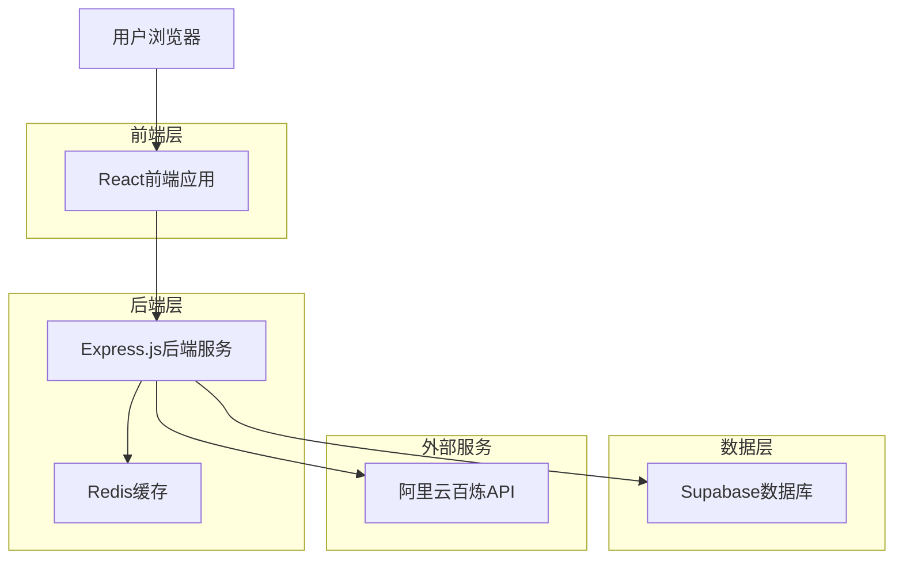
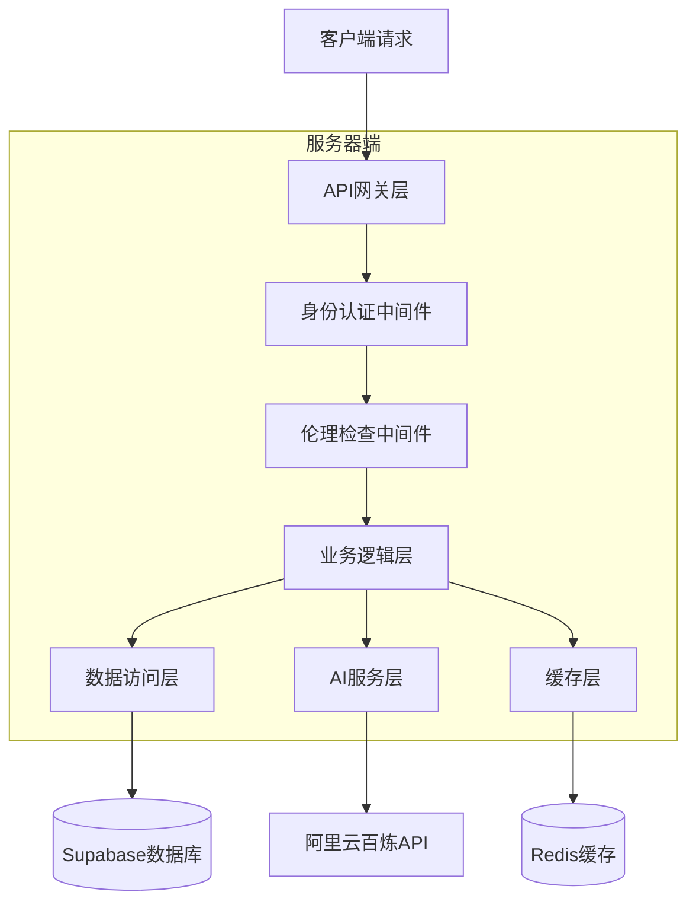
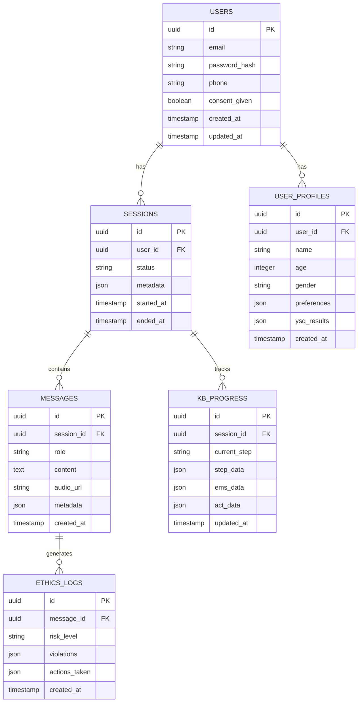

# AI咨询师Web应用技术架构文档

## 1. 架构设计



## 2. 技术描述

* 前端：React\@18 + TypeScript\@5 + Tailwind CSS\@3 + Vite\@5

* 后端：Express.js\@4 + Node.js\@18 + TypeScript\@5

* 数据库：Supabase (PostgreSQL\@15)

* 缓存：Redis\@7

* AI服务：阿里云百炼 qwen3-omni-flash API

* 实时通信：Socket.io\@4

* 身份认证：Supabase Auth

* 文件存储：Supabase Storage

## 3. 路由定义

| 路由         | 用途               |
| ---------- | ---------------- |
| /          | 首页，展示产品介绍和知情同意   |
| /login     | 登录页面，用户身份验证      |
| /register  | 注册页面，新用户注册       |
| /chat      | 咨询对话页面，核心AI交互功能  |
| /profile   | 个人中心，用户信息和咨询历史   |
| /resources | 资源库页面，心理健康教育内容   |
| /help      | 帮助中心，使用指南和紧急联系方式 |
| /admin     | 管理后台，系统监控和用户管理   |

## 4. API定义

### 4.1 核心API

#### 用户认证相关

```
POST /api/auth/register
```

请求参数：

| 参数名      | 参数类型    | 是否必需  | 描述     |
| -------- | ------- | ----- | ------ |
| email    | string  | true  | 用户邮箱   |
| password | string  | true  | 用户密码   |
| phone    | string  | false | 手机号码   |
| consent  | boolean | true  | 知情同意确认 |

响应参数：

| 参数名     | 参数类型    | 描述      |
| ------- | ------- | ------- |
| success | boolean | 注册是否成功  |
| user    | object  | 用户信息对象  |
| token   | string  | JWT认证令牌 |

#### AI咨询对话相关

```
POST /api/chat/message
```

请求参数：

| 参数名           | 参数类型   | 是否必需  | 描述           |
| ------------- | ------ | ----- | ------------ |
| message       | string | true  | 用户输入消息       |
| sessionId     | string | true  | 会话ID         |
| audioData     | string | false | 语音数据(base64) |
| currentKBStep | string | true  | 当前KB流程步骤     |

响应参数：

| 参数名           | 参数类型   | 描述             |
| ------------- | ------ | -------------- |
| response      | string | AI回复文本         |
| audioResponse | string | AI语音回复(base64) |
| nextKBStep    | string | 下一个KB流程步骤      |
| riskLevel     | string | 风险评估等级         |
| ethicsFlags   | array  | 伦理检查标记         |

#### 会话管理相关

```
GET /api/sessions/{userId}
```

响应参数：

| 参数名         | 参数类型   | 描述     |
| ----------- | ------ | ------ |
| sessions    | array  | 用户会话列表 |
| totalCount  | number | 总会话数量  |
| lastSession | object | 最近会话信息 |

#### 伦理监控相关

```
POST /api/ethics/check
```

请求参数：

| 参数名     | 参数类型   | 是否必需 | 描述    |
| ------- | ------ | ---- | ----- |
| content | string | true | 待检查内容 |
| context | object | true | 对话上下文 |
| userId  | string | true | 用户ID  |

响应参数：

| 参数名         | 参数类型    | 描述                             |
| ----------- | ------- | ------------------------------ |
| isCompliant | boolean | 是否符合伦理规范                       |
| violations  | array   | 违规项目列表                         |
| riskLevel   | string  | 风险等级(low/medium/high/critical) |
| actions     | array   | 建议采取的行动                        |

## 5. 服务器架构图



## 6. 数据模型

### 6.1 数据模型定义



### 6.2 数据定义语言

#### 用户表 (users)

```sql
-- 创建用户表
CREATE TABLE users (
    id UUID PRIMARY KEY DEFAULT gen_random_uuid(),
    email VARCHAR(255) UNIQUE NOT NULL,
    password_hash VARCHAR(255) NOT NULL,
    phone VARCHAR(20),
    consent_given BOOLEAN DEFAULT FALSE,
    created_at TIMESTAMP WITH TIME ZONE DEFAULT NOW(),
    updated_at TIMESTAMP WITH TIME ZONE DEFAULT NOW()
);

-- 创建索引
CREATE INDEX idx_users_email ON users(email);
CREATE INDEX idx_users_created_at ON users(created_at DESC);

-- 设置RLS策略
ALTER TABLE users ENABLE ROW LEVEL SECURITY;
CREATE POLICY "Users can view own data" ON users FOR SELECT USING (auth.uid() = id);
CREATE POLICY "Users can update own data" ON users FOR UPDATE USING (auth.uid() = id);
```

#### 用户档案表 (user\_profiles)

```sql
-- 创建用户档案表
CREATE TABLE user_profiles (
    id UUID PRIMARY KEY DEFAULT gen_random_uuid(),
    user_id UUID REFERENCES users(id) ON DELETE CASCADE,
    name VARCHAR(100),
    age INTEGER CHECK (age >= 18 AND age <= 120),
    gender VARCHAR(20),
    preferences JSONB DEFAULT '{}',
    ysq_results JSONB DEFAULT '{}',
    created_at TIMESTAMP WITH TIME ZONE DEFAULT NOW()
);

-- 创建索引
CREATE INDEX idx_user_profiles_user_id ON user_profiles(user_id);

-- 设置RLS策略
ALTER TABLE user_profiles ENABLE ROW LEVEL SECURITY;
CREATE POLICY "Users can manage own profile" ON user_profiles FOR ALL USING (auth.uid() = user_id);
```

#### 会话表 (sessions)

```sql
-- 创建会话表
CREATE TABLE sessions (
    id UUID PRIMARY KEY DEFAULT gen_random_uuid(),
    user_id UUID REFERENCES users(id) ON DELETE CASCADE,
    status VARCHAR(20) DEFAULT 'active' CHECK (status IN ('active', 'completed', 'terminated')),
    metadata JSONB DEFAULT '{}',
    started_at TIMESTAMP WITH TIME ZONE DEFAULT NOW(),
    ended_at TIMESTAMP WITH TIME ZONE
);

-- 创建索引
CREATE INDEX idx_sessions_user_id ON sessions(user_id);
CREATE INDEX idx_sessions_started_at ON sessions(started_at DESC);

-- 设置RLS策略
ALTER TABLE sessions ENABLE ROW LEVEL SECURITY;
CREATE POLICY "Users can manage own sessions" ON sessions FOR ALL USING (auth.uid() = user_id);
```

#### 消息表 (messages)

```sql
-- 创建消息表
CREATE TABLE messages (
    id UUID PRIMARY KEY DEFAULT gen_random_uuid(),
    session_id UUID REFERENCES sessions(id) ON DELETE CASCADE,
    role VARCHAR(20) NOT NULL CHECK (role IN ('user', 'assistant', 'system')),
    content TEXT NOT NULL,
    audio_url TEXT,
    metadata JSONB DEFAULT '{}',
    created_at TIMESTAMP WITH TIME ZONE DEFAULT NOW()
);

-- 创建索引
CREATE INDEX idx_messages_session_id ON messages(session_id);
CREATE INDEX idx_messages_created_at ON messages(created_at DESC);

-- 设置RLS策略
ALTER TABLE messages ENABLE ROW LEVEL SECURITY;
CREATE POLICY "Users can view own messages" ON messages FOR SELECT 
USING (EXISTS (SELECT 1 FROM sessions WHERE sessions.id = messages.session_id AND sessions.user_id = auth.uid()));
```

#### KB进度表 (kb\_progress)

```sql
-- 创建KB进度表
CREATE TABLE kb_progress (
    id UUID PRIMARY KEY DEFAULT gen_random_uuid(),
    session_id UUID REFERENCES sessions(id) ON DELETE CASCADE,
    current_step VARCHAR(50) NOT NULL,
    step_data JSONB DEFAULT '{}',
    ems_data JSONB DEFAULT '{}',
    act_data JSONB DEFAULT '{}',
    updated_at TIMESTAMP WITH TIME ZONE DEFAULT NOW()
);

-- 创建索引
CREATE INDEX idx_kb_progress_session_id ON kb_progress(session_id);

-- 设置RLS策略
ALTER TABLE kb_progress ENABLE ROW LEVEL SECURITY;
CREATE POLICY "Users can view own KB progress" ON kb_progress FOR SELECT 
USING (EXISTS (SELECT 1 FROM sessions WHERE sessions.id = kb_progress.session_id AND sessions.user_id = auth.uid()));
```

#### 伦理日志表 (ethics\_logs)

```sql
-- 创建伦理日志表
CREATE TABLE ethics_logs (
    id UUID PRIMARY KEY DEFAULT gen_random_uuid(),
    message_id UUID REFERENCES messages(id) ON DELETE CASCADE,
    risk_level VARCHAR(20) NOT NULL CHECK (risk_level IN ('low', 'medium', 'high', 'critical')),
    violations JSONB DEFAULT '[]',
    actions_taken JSONB DEFAULT '[]',
    created_at TIMESTAMP WITH TIME ZONE DEFAULT NOW()
);

-- 创建索引
CREATE INDEX idx_ethics_logs_message_id ON ethics_logs(message_id);
CREATE INDEX idx_ethics_logs_risk_level ON ethics_logs(risk_level);
CREATE INDEX idx_ethics_logs_created_at ON ethics_logs(created_at DESC);

-- 管理员权限策略
ALTER TABLE ethics_logs ENABLE ROW LEVEL SECURITY;
CREATE POLICY "Admins can view all ethics logs" ON ethics_logs FOR SELECT 
USING (auth.jwt() ->> 'role' = 'admin');
```

#### 初始化数据

```sql
-- 插入系统配置数据
INSERT INTO system_config (key, value) VALUES 
('kb_steps', '["KB-01", "KB-02", "KB-03", "KB-04", "KB-05"]'),
('ethics_rules', '{"max_session_duration": 7200, "risk_keywords": ["自杀", "自伤", "伤害他人"]}'),
('emergency_contacts', '{"crisis_hotline": "400-161-9995", "emergency": "120"}');

-- 创建管理员用户
INSERT INTO users (email, password_hash, consent_given) VALUES 
('admin@example.com', '$2b$10$encrypted_password_hash', true);
```

## 7. 安全与合规机制

### 7.1 数据安全

* 所有敏感数据采用AES-256加密存储

* API通信使用HTTPS/TLS 1.3加密

* 实施数据最小化原则，定期清理过期数据

* 用户数据支持完全删除和导出

### 7.2 伦理合规

* 实时内容审核，检测自伤/他伤风险

* 自动触发保密例外处理流程

* 记录所有伦理相关事件和处理措施

* 提供人工干预和专业转介机制

### 7.3 访问控制

* 基于JWT的身份认证

* 细粒度的权限控制

* API访问频率限制

* 异常访问行为监控和告警

### 7.4 监控与审计

* 全链路日志记录

* 实时性能监控

* 定期安全审计

* 合规性检查报告

## 8. 部署架构

### 8.1 容器化部署

```dockerfile
# 前端Dockerfile
FROM node:18-alpine
WORKDIR /app
COPY package*.json ./
RUN npm ci --only=production
COPY . .
RUN npm run build
EXPOSE 3000
CMD ["npm", "start"]

# 后端Dockerfile
FROM node:18-alpine
WORKDIR /app
COPY package*.json ./
RUN npm ci --only=production
COPY . .
EXPOSE 8000
CMD ["npm", "run", "start:prod"]
```

### 8.2 环境配置

```yaml
# docker-compose.yml
version: '3.8'
services:
  frontend:
    build: ./frontend
    ports:
      - "3000:3000"
    environment:
      - REACT_APP_API_URL=http://backend:8000
      - REACT_APP_SUPABASE_URL=${SUPABASE_URL}
      - REACT_APP_SUPABASE_ANON_KEY=${SUPABASE_ANON_KEY}
  
  backend:
    build: ./backend
    ports:
      - "8000:8000"
    environment:
      - NODE_ENV=production
      - SUPABASE_URL=${SUPABASE_URL}
      - SUPABASE_SERVICE_KEY=${SUPABASE_SERVICE_KEY}
      - DASHSCOPE_API_KEY=${DASHSCOPE_API_KEY}
      - REDIS_URL=${REDIS_URL}
    depends_on:
      - redis
  
  redis:
    image: redis:7-alpine
    ports:
      - "6379:6379"
```

## 9. 性能优化

### 9.1 前端优化

* 代码分割和懒加载

* 静态资源CDN加速

* 组件级缓存策略

* 虚拟滚动优化长列表

### 9.2 后端优化

* Redis缓存热点数据

* 数据库查询优化

* API响应压缩

* 连接池管理

### 9.3 AI服务优化

* 请求去重和缓存

* 异步处理长时间任务

* 智能重试机制

* 负载均衡和故障转移

